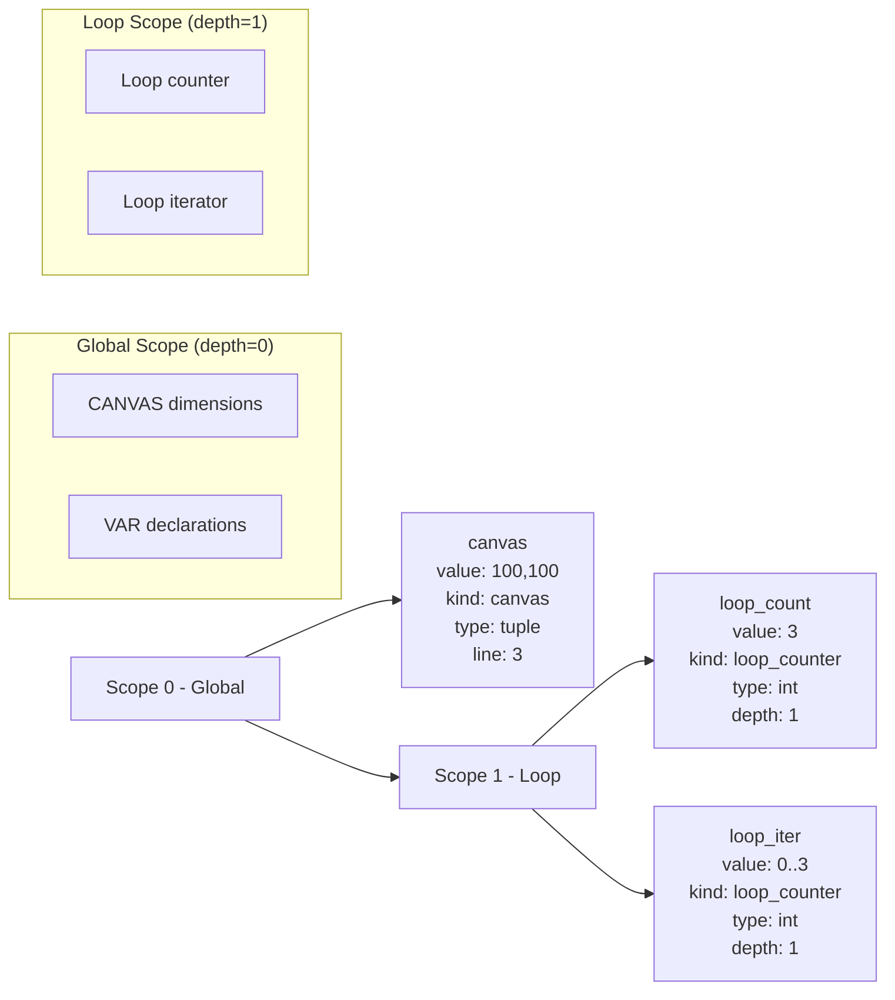
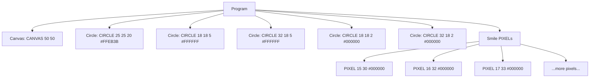
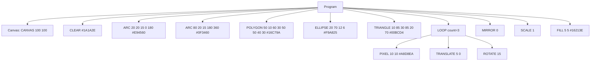
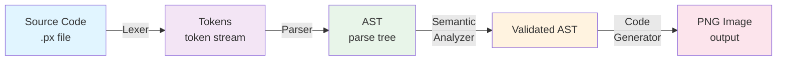

# PixelLang Compiler - Technical Diagrams

Complete visual reference for the PixelLang compiler architecture including DFA transition table, symbol table structure, and parse tree examples.

---

## 1. Lexical Analyzer DFA (Transition Table)

The lexer uses a Deterministic Finite Automaton to tokenize source code. Each path through the DFA recognizes a specific token type.

```mermaid
stateDiagram-v2
    [*] --> start

    start --> Word : [A-Za-z_]
    Word --> Word : [A-Za-z0-9_]
    Word --> IDENT : (non-alnum)

    start --> Number : [0-9]
    Number --> Number : [0-9]
    Number --> NUMBER : (non-digit)

    start --> Hash : '#'
    Hash --> Hex1 : [0-9A-Fa-f]
    Hex1 --> Hex2 : [0-9A-Fa-f]
    Hex2 --> Hex3 : [0-9A-Fa-f]
    Hex3 --> Hex4 : [0-9A-Fa-f]
    Hex4 --> Hex5 : [0-9A-Fa-f]
    Hex5 --> Hex6 : [0-9A-Fa-f]
    Hex6 --> COLOR : (accept)

    start --> Quote : '"' or '\''
    Quote --> InString : (any but quote/newline)
    InString --> InString : (any but quote/newline)
    InString --> STRING : (closing quote)

    start --> LBrace : '{'
    LBrace --> LBRACE
    start --> RBrace : '}'
    RBrace --> RBRACE
    start --> Semicolon : ';'
    Semicolon --> SEMICOLON

    start --> Slash : '/'
    Slash --> LineComment : '/' (then skip to newline)
    Slash --> BlockComment : '*' (then skip until '*/')

    start --> Binary : [0|1] (if 4+ bits)
    Binary --> Binary : [0|1]
    Binary --> IDENT : (accept pattern)

    start --> EOF : (end)
```



### Token Recognition Rules

| Token Type | Pattern | Example |
|-----------|---------|---------|
| **KEYWORD** | All-uppercase reserved words | `CANVAS`, `PIXEL`, `LOOP` |
| **IDENT** | `[A-Za-z_][A-Za-z0-9_]*` | `myVar`, `_private` |
| **NUMBER** | `[0-9]+` | `42`, `100` |
| **COLOR** | `#` + 6 hex digits | `#FFEB3B`, `#1A1A2E` |
| **STRING** | `"` or `'` enclosed text | `"Hello"`, `'World'` |
| **BINARY** | 4+ consecutive 0/1 | `0110`, `11001100` |
| **LBRACE** | `{` | - |
| **RBRACE** | `}` | - |
| **SEMICOLON** | `;` | - |

---

## 2. Symbol Table and Scopes

The symbol table is **stack-based** with support for nested scopes (e.g., inside `LOOP` blocks).



### Symbol Table Entry Structure

```
{
  name: str              # Symbol name
  value: any            # Current value
  kind: str             # 'canvas', 'variable', 'loop_counter'
  value_type: str       # 'int', 'tuple', 'color', etc.
  defined_at: int       # Source line number
  scope_depth: int      # Nesting level (0=global, 1+=nested)
}
```

### Scope Management

- **Global Scope (depth 0)**: Holds `CANVAS` definition and any `VAR` declarations
- **Loop Scope (depth 1+)**: Created when entering `LOOP` block, destroyed on exit
- **Stack Operations**: 
  - `enter_scope()` - Push new scope onto stack
  - `exit_scope()` - Pop scope from stack
  - `define(name, value, kind)` - Add symbol to current scope
  - `lookup(name)` - Search current scope and parent scopes

---

## 3. Parse Tree Examples

The parser builds an Abstract Syntax Tree (AST) using recursive descent. Each statement type has its own node class.

### Example 1: smiley.px



### Example 2: advanced_shapes_demo.px (with LOOP)



### Parse Tree Node Types

| Node Class | Purpose | Children |
|-----------|---------|----------|
| **Program** | Root node | List of statements |
| **CanvasNode** | Canvas definition | None (stores width, height) |
| **PixelNode** | Single pixel | None (x, y, color) |
| **CircleNode** | Circle shape | None (cx, cy, radius, color) |
| **RectNode** | Rectangle shape | None (x, y, w, h, color) |
| **EllipseNode** | Ellipse shape | None (cx, cy, rx, ry, color) |
| **LoopNode** | Loop block | List of body statements |
| **TransformNode** | Rotation/scale/translate | None (command, angle/scale/offset) |
| **FillNode** | Flood fill | None (x, y, color) |
| **LineNode** | Line drawing | None (x1, y1, x2, y2, color) |

---

## Compilation Pipeline



### Phase Details

1. **Lexer** (`lexer.py`): Tokenizes source using DFA
2. **Parser** (`parser.py`): Builds AST using LL(1) recursive descent
3. **Semantic Analyzer** (`semantic.py`): Validates 13 semantic rules, populates symbol table
4. **Code Generator** (`codegen.py`): Generates PNG image using Pillow

---

## References

- [Full Documentation](DOCUMENTATION.md)
- [Implementation Guide](../IMPLEMENTATION_GUIDE.md)
- [Lexer DFA Details](diagrams/lexer_dfa.md)
- [Symbol Table Details](diagrams/symbol_table_diagram.md)
- [Parse Tree Examples](diagrams/parse_trees_examples.md)
