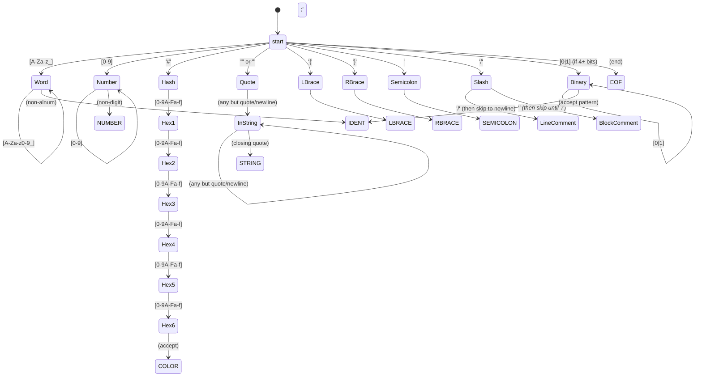

# Lexer DFA

This document contains the DFA transition diagram used by the lexer to recognize tokens.

```mermaid
stateDiagram-v2
    [*] --> start

    start --> Word : [A-Za-z_]
    Word --> Word : [A-Za-z0-9_]
    Word --> IDENT : (non-alnum)

    start --> Number : [0-9]
    Number --> Number : [0-9]
    Number --> NUMBER : (non-digit)

    start --> Hash : '#'
    Hash --> Hex1 : [0-9A-Fa-f]
    Hex1 --> Hex2 : [0-9A-Fa-f]
    Hex2 --> Hex3 : [0-9A-Fa-f]
    Hex3 --> Hex4 : [0-9A-Fa-f]
    Hex4 --> Hex5 : [0-9A-Fa-f]
    Hex5 --> Hex6 : [0-9A-Fa-f]
    Hex6 --> COLOR : (accept)

    start --> Quote : '"' or '\''
    Quote --> InString : (any but quote/newline)
    InString --> InString : (any but quote/newline)
    InString --> STRING : (closing quote)

    start --> LBrace : '{'
    LBrace --> LBRACE
    start --> RBrace : '}'
    RBrace --> RBRACE
    start --> Semicolon : ';'
    Semicolon --> SEMICOLON

    start --> Slash : '/'
    Slash --> LineComment : '/' (then skip to newline)
    Slash --> BlockComment : '*' (then skip until '*/')

    start --> Binary : [0|1] (if 4+ bits)
    Binary --> Binary : [0|1]
    Binary --> IDENT : (accept pattern)

    start --> EOF : (end)
```
