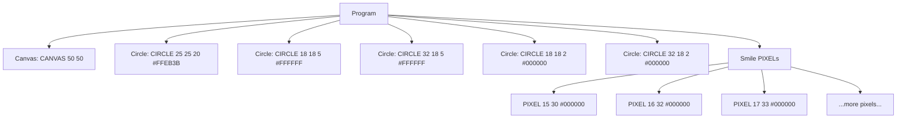

# Parse Tree Examples

Example parse trees for representative PixelLang programs.

```mermaid
graph TD
  P[Program]
  P --> CANVAS1["Canvas: CANVAS 50 50"]
  P --> CIRC1["Circle: CIRCLE 25 25 20 #FFEB3B"]
  P --> CIRC2["Circle: CIRCLE 18 18 5 #FFFFFF"]
  P --> CIRC3["Circle: CIRCLE 32 18 5 #FFFFFF"]
  P --> CIRC4["Circle: CIRCLE 18 18 2 #000000"]
  P --> CIRC5["Circle: CIRCLE 32 18 2 #000000"]
  P --> PIXELS["Smile PIXELs"]

  PIXELS --> PIX1["PIXEL 15 30 #000000"]
  PIXELS --> PIX2["PIXEL 16 32 #000000"]
  PIXELS --> PIX3["PIXEL 17 33 #000000"]
  PIXELS --> PIX4["...more pixels..."]
```
