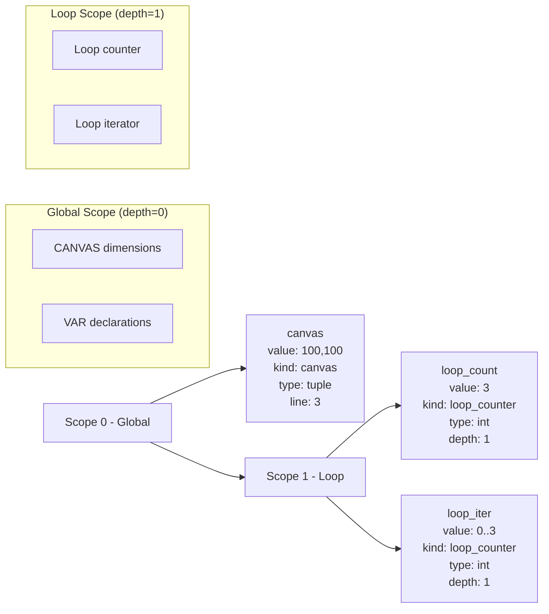

# Symbol Table Diagram

Stack-based symbol table with nested scopes (global, loop scopes).

```mermaid
graph LR
  Global[Scope 0 - Global]
  Global --> CanvasSym["canvas<br/>value: 100,100<br/>kind: canvas<br/>type: tuple<br/>line: 3"]

  Global --> LoopScope[Scope 1 - Loop]
  LoopScope --> LoopCount["loop_count<br/>value: 3<br/>kind: loop_counter<br/>type: int<br/>depth: 1"]
  LoopScope --> LoopIter["loop_iter<br/>value: 0..3<br/>kind: loop_counter<br/>type: int<br/>depth: 1"]

  subgraph GlobalScope["Global Scope (depth=0)"]
    direction LR
    G1["CANVAS dimensions"]
    G2["VAR declarations"]
  end

  subgraph LoopScope2["Loop Scope (depth=1)"]
    direction LR
    L1["Loop counter"]
    L2["Loop iterator"]
  end
```
